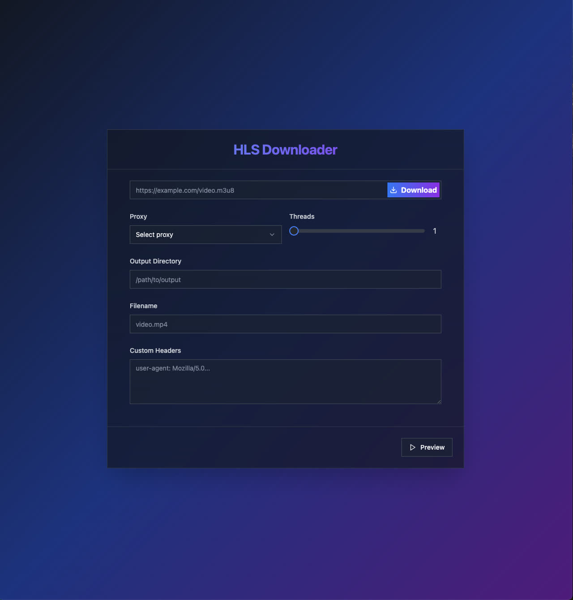

# franky

## Getting Started

## M3U8 Downloader

A simple and efficient m3u8 downloader that allows you to download and merge HLS (HTTP Live Streaming) content into a single MP4 file.



### Prerequisites

Before using this downloader, you need to install FFmpeg on your system. FFmpeg is used to merge the downloaded .ts files into a single MP4 file.

#### Installing FFmpeg

##### Windows:

1. Download the latest FFmpeg build from [FFmpeg Builds](https://www.ffmpeg.org/download.html).
2. Extract the zip file to a location of your choice (e.g. `C:\ffmpeg`).
3. Add the FFmpeg `bin` folder (e.g. `C:\ffmpeg\bin`) to your system's PATH environment variable.

##### macOS:

The easiest way to install FFmpeg on macOS is using Homebrew:

1. Install Homebrew if you haven't already:
   ```sh
   /bin/bash -c "$(curl -fsSL https://raw.githubusercontent.com/Homebrew/install/HEAD/install.sh)"
   ```
2. Install FFmpeg:
   ```sh
   brew install ffmpeg
   ```

### Usage

1. Download the latest release from the [GitHub releases page](https://github.com/Lysander66/franky/releases). Choose the appropriate version for your system:
   - For macOS:
     - Intel chip: `m3u8dl-1.0.0-darwin-amd64`
     - Apple chip (M series): `m3u8dl-1.0.0-darwin-arm64`
   - For Windows:
     - 64-bit Intel/AMD: `m3u8dl-1.0.0-win-amd64.exe`
     - ARM-based: `m3u8dl-1.0.0-win-arm64.exe`
2. Run the downloaded executable file.
3. Open your web browser and visit http://localhost:3000.
4. You're all set! Feel free to use the M3U8 Downloader.
